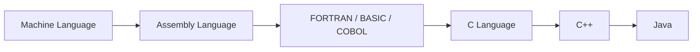

# Birth of Java 🚀

Programming languages have come a long way — from writing raw binary instructions to a language that runs anywhere. Let’s walk through this journey step by step 👇

---

### 1. Machine Language (1940s–50s) 💻


- Programs written directly in `0s` and `1s`.
- Very hard for humans to understand.
- Example: `10110000 01100001`  
  ❌ Tedious and error-prone.

---

### 2. Assembly Language (1950s–60s) 🛠️
- Introduced **mnemonics** (e.g., `MOV A, B`) instead of binary.
- Easier than machine code, but still **low-level**.  
  ❌ Hardware-specific and hard to scale.

---

### 3. High-Level, Domain-Specific Languages (1960s–70s) 🌐
- **FORTRAN** → Scientific applications
- **BASIC** → Education, games
- **COBOL** → Business applications

❌ Limitation: Each was **domain-specific** (not general purpose).

---

### 4. C Language (1970s) ⚡
- General-purpose and efficient.
- Made **system-level programming** easier.
- Fast + powerful.  
  ✅ Huge step forward, but still tied to platforms.

---

### 5. C++ (1980s) ➕➕
- Extension of C with **Object-Oriented Programming (OOP)**.
- Great for large & complex software projects.  
  ❌ Still **platform-dependent**.

---

### 6. 1990s: Internet Era 🌍
- Rise of microprocessors and consumer devices.
- Creating separate compilers for each device was **impractical**.
- Needed a **platform-independent** language.

---

### 7. Birth of Java (1995) ☕


- Created by **Sun Microsystems**.
- Initially for **consumer electronics**.
- Famous for the principle:  
  👉 **"Write Once, Run Anywhere"**
- Perfect for the **Internet age** and **cross-platform development**.

---

## 🔹 Visual Flow of Evolution



---

## 🧭 Evolution at a Glance

| Era | Language | Big Idea | Main Limitation |
|-----|----------|----------|-----------------|
| 1940s–50s | Machine Language | Runs directly on hardware | Pure `0s`/`1s`, unreadable |
| 1950s–60s | Assembly | Mnemonics instead of binary | Hardware-specific |
| 1960s–70s | FORTRAN / BASIC / COBOL | High-level, human-readable | Domain-specific |
| 1970s | C | General-purpose, fast, system-level | Platform-dependent |
| 1980s | C++ | Added OOP to C | Still platform-dependent |
| 1995 | **Java** | **Bytecode + JVM = WORA** | Slightly slower than C/C++ |

---

## 💡 Why "Write Once, Run Anywhere" Was Revolutionary

Before Java, a program compiled on Windows would **not** run on Mac or Linux — you needed a separate compiler and build for **each** platform. 😫

Java solved this with a clever middle layer:

```
Your Code (.java)
      │  javac (compiler)
      ▼
Bytecode (.class)   ← platform-INDEPENDENT
      │  JVM (one per OS)
      ▼
Runs on Windows / Mac / Linux / Android …
```

👉 You compile **once** into bytecode; any device with a **JVM** can run it. The JVM absorbs the platform differences, not you. This made Java perfect for the **Internet age** (1990s), where code had to travel across wildly different machines.

---

## 📌 Key Takeaways

- Languages evolved from **hardware-close → human-close → platform-independent**.
- Java (1995, Sun Microsystems, James Gosling) was built for **portability + security**.
- The secret sauce is **bytecode + JVM**, enabling **WORA**.
- Originally named **Oak**, later renamed **Java** ☕.
