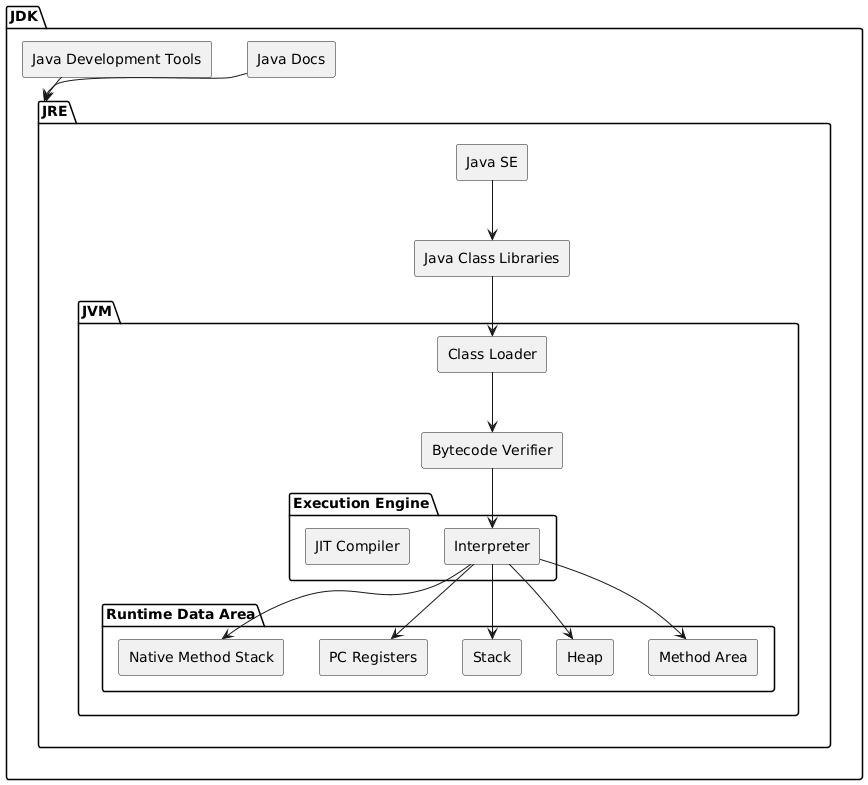

# ☕ Structure of Java - JDK, JRE & JVM

Understanding Java’s structure is crucial to know **how your code runs**.  
Java is designed with **layers of abstraction**, just like a processor architecture in textbooks.

---

## 📚 JDK Components

The **Java Development Kit (JDK)** contains everything needed to **develop, compile, and run Java programs**:

- **Java Docs** → Official documentation for developers.
- **Java Development Tools** → Tools like `javac`, `jar`, `jdb`, etc.
- **JRE (Java Runtime Environment)** → Environment to **run Java programs**, includes:
    - **Java SE** → Standard libraries for basic programming.
    - **Java Class Libraries** → Core APIs (Collections, IO, Networking, etc.)
    - **JVM (Java Virtual Machine)** → Executes compiled Java bytecode.

---

## ⚙️ Inside the JVM

The **JVM** is where the magic happens — it executes Java bytecode. Components include:

- **Class Loader** → Loads `.class` files into memory.
- **Bytecode Verifier** → Ensures the loaded bytecode is safe and valid.
- **Execution Engine** → Runs bytecode using:
    - **Interpreter** → Executes instructions one by one.
    - **JIT Compiler** → Compiles bytecode into native machine code for speed.
- **Runtime Data Area** → Memory management and program execution:
    - **Method Area** → Stores class structures and metadata.
    - **Heap** → Stores objects at runtime.
    - **Stack** → Stores method calls and local variables.
    - **PC Registers** → Tracks current instruction.
    - **Native Method Stack** → Handles native code calls.

---

## 🖼️ Block Diagram of Java Structure

