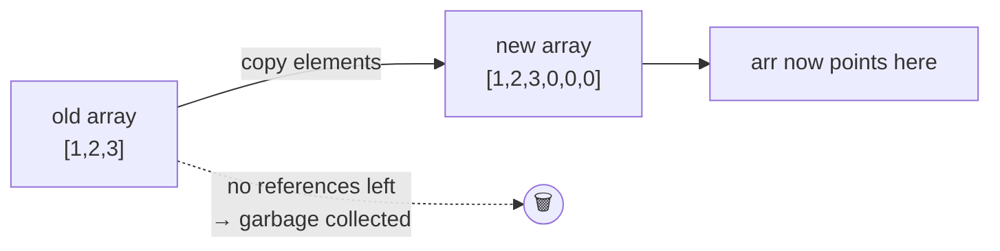

# 🛠️ Array Operations — Copy, Compare, Resize, Shift & Rotate

File 1 covered *what* an array is. This file covers **what you actually do to one**: duplicate it,
compare it, "grow" it, and slide its elements around — plus the `java.util.Arrays` toolbox that does
most of it in one line.

---

## ⚠️ First: Assignment Is **NOT** a Copy

```java
int[] a = {1, 2, 3};
int[] b = a;          // ⚠️ copies the REFERENCE, not the elements
b[0] = 99;
System.out.println(a[0]);   // 99  ← a changed too!
```

```text
   ┌───────┐                 ┌──────────────────┐
   │  a  ──┼────────────────▶│  [99, 2, 3]      │   ONE array,
   └───────┘            ┌───▶│                  │   TWO names
   ┌───────┐            │    └──────────────────┘   (this is called ALIASING)
   │  b  ──┼────────────┘
   └───────┘
```

A real copy needs a **second array object**:

```java
int[] b = a.clone();
b[0] = 99;
System.out.println(a[0]);   // 1  ✅ independent
```

```text
   ┌───────┐      ┌──────────────┐
   │  a  ──┼─────▶│  [1, 2, 3]   │
   └───────┘      └──────────────┘
   ┌───────┐      ┌──────────────┐
   │  b  ──┼─────▶│  [99, 2, 3]  │   two objects, two lives
   └───────┘      └──────────────┘
```

---

## 📋 The Four Ways to Copy an Array

```java
int[] source = {10, 20, 30, 40, 50};
```

### 1️⃣ Manual loop — what `coding_2/CopyArray.java` does

```java
int[] copy = new int[source.length];
for (int i = 0; i < source.length; i++) {
    copy[i] = source[i];
}
```
✅ Full control (copy backwards, skip elements, transform on the way).
❌ Most typing, slowest.

> 💡 `CopyArray.java` uses a for-each with a separate cursor — `for (int e : source) copy[j++] = e;`
> — which works because for-each *reads* fine; only writing back needs an index.

### 2️⃣ `clone()` — shortest for a full copy

```java
int[] copy = source.clone();     // same length, same contents, new object
```
✅ One word. ❌ Can't change the size, and it is **shallow** (see below).

### 3️⃣ `Arrays.copyOf()` / `copyOfRange()` — copy **and** resize/slice

```java
import java.util.Arrays;

int[] same    = Arrays.copyOf(source, source.length);      // [10,20,30,40,50]
int[] bigger  = Arrays.copyOf(source, 8);                  // [10,20,30,40,50, 0,0,0]  ← padded
int[] smaller = Arrays.copyOf(source, 3);                  // [10,20,30]               ← truncated
int[] slice   = Arrays.copyOfRange(source, 1, 4);          // [20,30,40]  from=1 inclusive, to=4 EXCLUSIVE
```
✅ The idiomatic modern choice — and **the only way to "grow" an array**.

> ⚠️ `copyOfRange(from, to)`: `to` is **exclusive**, so the new length is `to - from`. `to` may
> exceed the source length (the rest is padded with defaults), but `from` may not.

### 4️⃣ `System.arraycopy()` — fastest, partial copies

```java
System.arraycopy(source, 1, dest, 0, 3);
//               src   srcPos dest destPos length
```
✅ A native, intrinsified method — the fastest option, and the engine **inside** `clone()`,
`copyOf()`, `ArrayList`, and `StringBuilder`.
❌ Five arguments, easy to mis-order.

### Which one should I use?

| Need | Use |
|------|-----|
| Exact duplicate, same size | `clone()` |
| Copy with a **different size** (grow/shrink) | `Arrays.copyOf()` |
| A **sub-range** | `Arrays.copyOfRange()` |
| Copy *into an existing* array, or a partial block | `System.arraycopy()` |
| Transform while copying (`×2`, filter, reverse) | Manual loop |

---

## 🪞 Shallow vs Deep Copy

Every method above is **shallow**: it copies the *slots*. For `int[]` that is the whole story — the
values live in the slots. For an array **of objects** (including a 2D array, which is an array of
arrays) the slots hold references, so both arrays end up pointing at the **same inner objects**.

```java
int[][] original = {{1, 2}, {3, 4}};
int[][] shallow  = original.clone();      // copies the two ROW REFERENCES only

shallow[0][0] = 99;
System.out.println(original[0][0]);       // 99  😱 shared row!

shallow[0] = new int[]{7, 7};             // replacing a whole row IS independent
System.out.println(original[0][0]);       // 99  (unchanged by this line)
```

```text
   original ──▶ [ • , • ]          shallow ──▶ [ • , • ]
                  │   │                          │   │
                  ▼   ▼                          ▼   ▼
              [99,2] [3,4] ◀────────────────────────┘   ← SAME row objects
```

**Deep copy** = copy every level yourself:

```java
int[][] deep = new int[original.length][];
for (int i = 0; i < original.length; i++) {
    deep[i] = original[i].clone();        // clone each row
}
```

> 💡 Rule: `clone()` is deep for **one dimension of primitives**, shallow for **everything else**.

---

## ⚖️ Comparing Arrays

```java
int[] a = {1, 2, 3};
int[] b = {1, 2, 3};

System.out.println(a == b);                  // false ← two different objects (address compare)
System.out.println(a.equals(b));             // false ← Arrays don't override equals(); same as ==
System.out.println(Arrays.equals(a, b));     // true  ✅ element-by-element
```

| Goal | Call |
|------|------|
| Same **object**? | `a == b` |
| Same **contents** (1D)? | `Arrays.equals(a, b)` |
| Same **contents** (2D / nested)? | `Arrays.deepEquals(a, b)` |
| Lexicographic order (Java 9+) | `Arrays.compare(a, b)` → `<0`, `0`, `>0` |
| **First index where they differ** (Java 9+) | `Arrays.mismatch(a, b)` → index, or `-1` if equal |

> ⚠️ `Arrays.equals` on a 2D array compares the **row references**, so it returns `false` for two
> identical-looking matrices. Use `deepEquals`. Same trap as `toString` vs `deepToString`.

> 💡 `Arrays.equals` also returns `true` for two `null`s, and `false` for different lengths — no
> `NullPointerException`, no manual length check needed.

---

## 📈 "Resizing" an Array (spoiler: you can't)

An array's length is **final**. Growing means *allocate bigger + copy + re-point*:

```java
int[] arr = {1, 2, 3};
arr = Arrays.copyOf(arr, arr.length * 2);   // [1,2,3,0,0,0] — a NEW object, old one becomes garbage
```



That copy is **O(n)**. Doing it on every insert is O(n²) — which is exactly why `ArrayList` doubles
its capacity instead of growing by one (Chapter 10).

### Simulating insert & delete

Arrays have no `insert`/`remove`, so you shift manually and track a **logical size** separate from
`arr.length`:

```java
// INSERT value at index — everything from index onward moves RIGHT (loop backwards!)
static int insert(int[] arr, int size, int index, int value) {
    for (int i = size; i > index; i--) arr[i] = arr[i - 1];
    arr[index] = value;
    return size + 1;                      // new logical size
}

// DELETE at index — everything after it moves LEFT (loop forwards!)
static int delete(int[] arr, int size, int index) {
    for (int i = index; i < size - 1; i++) arr[i] = arr[i + 1];
    arr[size - 1] = 0;                    // optional: clear the stale tail
    return size - 1;
}
```

> ⚠️ **Direction matters.** Shifting right with a forward loop smears one value across the whole
> array (`[1,2,3] → [1,1,1]`); shifting left with a backward loop does the same. Right → loop
> **backwards**; left → loop **forwards**.

> 💡 That "logical size vs physical length" split is the pattern behind
> `coding_9/DuplicateRemover.java` — it returns `j + 1` as the new size and then prints only
> `0 … size-1`, because the array itself still has its original length with stale junk at the end.

---

## 🔄 Reversing In Place — the Two-Pointer Swap

```java
public static void reverse(int[] arr) {
    for (int i = 0, j = arr.length - 1; i < j; i++, j--) {
        int temp = arr[i];
        arr[i]   = arr[j];
        arr[j]   = temp;
    }
}
```

```text
   [10, 20, 30, 40, 50]
     i↑              ↑j     swap 10↔50  →  [50, 20, 30, 40, 10]
         i↑      ↑j         swap 20↔40  →  [50, 40, 30, 20, 10]
             i↑ ↑j          i >= j → stop (the middle element stays put)
```

- **O(n/2) swaps, O(1) extra memory** — no second array needed (`coding_7/ArrayReverse.java`).
- The condition `i < j` also works as `i < n/2`; both stop correctly for odd **and** even lengths.
- Swapping needs a `temp` — Java has no `a, b = b, a`.

> ⚠️ Common bug: looping `i` over the **whole** array instead of half. Every element gets swapped
> twice and you get the original array back.

---

## ↔️ Shifting vs Rotating (they are different!)

| | **Shift** | **Rotate** |
|---|---|---|
| What happens to the element that falls off | **Lost**, a `0`/blank comes in | **Wraps around** to the other end |
| `[1,2,3,4]` left by 1 | `[2,3,4,0]` | `[2,3,4,1]` |

Your `coding_11` / `coding_12` files implement **rotation** (the elements wrap):

```java
// ROTATE LEFT by 1 — save the first, slide everything left, put it at the end
public static void rotateLeft(int[] arr) {
    int first = arr[0];
    for (int i = 1; i < arr.length; i++) arr[i - 1] = arr[i];   // forward loop
    arr[arr.length - 1] = first;
}

// ROTATE RIGHT by 1 — save the last, slide everything right, put it at the front
public static void rotateRight(int[] arr) {
    int last = arr[arr.length - 1];
    for (int i = arr.length - 1; i > 0; i--) arr[i] = arr[i - 1];  // backward loop
    arr[0] = last;
}
```

```text
ROTATE LEFT                          ROTATE RIGHT
  ┌─┐                                              ┌─┐
  │1│ 2  3  4   save first=1          1  2  3  4   │4│  save last=4
  └─┘                                              └─┘
   2  3  4  _   slide ←                _  1  2  3      slide →
   2  3  4 [1]  place at end          [4] 1  2  3      place at front
```

### Rotating by **k** — the reversal trick

Calling `rotateLeft` k times is O(n·k). The elegant way is **O(n) time, O(1) space** — reverse three
times:

```java
public static void rotateLeftByK(int[] arr, int k) {
    int n = arr.length;
    k = ((k % n) + n) % n;          // normalise: k > n, and negative k, both handled
    reverse(arr, 0, k - 1);         // reverse the first k
    reverse(arr, k, n - 1);         // reverse the rest
    reverse(arr, 0, n - 1);         // reverse the whole thing
}
```

```text
[1,2,3,4,5,6,7], k = 2
reverse(0,1)  →  [2,1, 3,4,5,6,7]
reverse(2,6)  →  [2,1, 7,6,5,4,3]
reverse(0,6)  →  [3,4,5,6,7, 1,2]   ✅ rotated left by 2
```

> ⚠️ Always do `k % n` first. `k = 7` on a 7-element array is **zero work**, and skipping the modulo
> is an instant `ArrayIndexOutOfBoundsException` in the temp-array version.

---

## ➕ Merging Two Arrays

```java
public static int[] merge(int[] a, int[] b) {
    int[] result = new int[a.length + b.length];
    System.arraycopy(a, 0, result, 0,        a.length);   // a → front
    System.arraycopy(b, 0, result, a.length, b.length);   // b → after a
    return result;
}
```

The manual version (`coding_10/MergeArrays.java`) is two loops and one shared cursor:

```java
int k = 0;
for (int x : a) result[k++] = x;
for (int x : b) result[k++] = x;
```

> 💡 Merging two **already sorted** arrays into a sorted result is a different (and more useful)
> problem — walk both with two pointers, always taking the smaller head. That is the *merge* half of
> merge sort, and it's O(n + m) instead of O((n+m) log(n+m)).

---

## 🧰 The `java.util.Arrays` Cheat Sheet

```java
import java.util.Arrays;      // ← forget this and nothing below compiles
```

| Method | What it does | Note |
|--------|--------------|------|
| `Arrays.toString(a)` | `[1, 2, 3]` for printing | 1D only |
| `Arrays.deepToString(a)` | `[[1, 2], [3, 4]]` | For 2D/nested |
| `Arrays.sort(a)` | Sorts **in place**, ascending | Mutates the caller's array! |
| `Arrays.sort(a, from, to)` | Sorts a sub-range | `to` exclusive |
| `Arrays.binarySearch(a, key)` | Index of `key`, or a negative number | **Array must be sorted** |
| `Arrays.fill(a, 7)` | Sets every slot to `7` | Also `fill(a, from, to, v)` |
| `Arrays.setAll(a, i -> i * i)` | Fills from the index | `[0,1,4,9,…]` |
| `Arrays.equals(a, b)` / `deepEquals` | Content comparison | See table above |
| `Arrays.copyOf` / `copyOfRange` | Copy, resize, slice | Covered above |
| `Arrays.stream(a).sum()` | `sum`, `max`, `min`, `average`, `count` | Chapter 10+ |
| `Arrays.asList(a)` | Array → `List` view | ⚠️ traps below |

```java
int[] a = new int[5];
Arrays.fill(a, -1);                       // [-1,-1,-1,-1,-1]
System.out.println(Arrays.stream(a).sum());  // -5
```

> ⚠️ **`Arrays.sort` sorts descending? No.** There is no reverse-order overload for primitives. Sort
> ascending then reverse, or use `Integer[]` with
> `Arrays.sort(boxed, Collections.reverseOrder())` (Chapter 9/10).

> ⚠️ **`Arrays.asList(intArray)` is a classic trap:** it returns a `List<int[]>` of **size 1**, not a
> list of 5 integers — because `int[]` is itself one object. It works as expected only with object
> arrays (`Integer[]`, `String[]`). And that list is **fixed-size** — `add()` throws
> `UnsupportedOperationException`.

> 💡 `Arrays.sort` on primitives uses **dual-pivot quicksort**; on objects it uses **TimSort** (a
> stable merge sort). That difference matters the moment you sort objects — details in file 4.

---

## ⏱️ Cost of Each Operation

| Operation | Time | Why |
|-----------|------|-----|
| Read/write `arr[i]` | **O(1)** | Address arithmetic |
| Search (unsorted) | O(n) | Must look at everything |
| Search (sorted, binary) | O(log n) | Halve the range each step |
| Insert/delete at the **end** (with spare room) | O(1) | Nothing moves |
| Insert/delete at the **start/middle** | O(n) | Everything after it shifts |
| Copy / resize / merge | O(n) | Touch every element |
| Reverse / rotate (reversal trick) | O(n) time, O(1) space | In-place swaps |
| Rotate by k naively | O(n·k) | k separate passes |

---

## 🐞 Common Mistakes

| Mistake | Result |
|---------|--------|
| `int[] b = a;` expecting a copy | Both names edit one array |
| Forgetting `import java.util.Arrays;` | *cannot find symbol: variable Arrays* |
| Shifting right with a forward loop | `[1,2,3] → [1,1,1]` — value smeared |
| Losing the wrapped element before the loop | Rotation turns into a shift, data lost |
| Using `arr.length` as the count after removing duplicates | Prints stale garbage at the tail |
| `Arrays.binarySearch` on an unsorted array | Silently wrong answer, no exception |
| `Arrays.equals` on a 2D array | Always `false` |
| Sorting the input then reporting "positions" | Positions refer to the **sorted** array |

---

## 🗂️ Where to Practise This

| Concept | File in `coding-practice/` |
|---------|---------------------------|
| Copying element by element | `coding_2/CopyArray.java` |
| In-place reversal (two pointers) | `coding_7/ArrayReverse.java` |
| Logical size vs physical length | `coding_9/DuplicateRemover.java` |
| Merging arrays | `coding_10/MergeArrays.java` |
| Rotate left by 1 | `coding_11/LeftShiftingArray.java` |
| Rotate right by 1 / both directions | `coding_12/RightShiftingArray.java`, `RotateArray.java` |
| Shifting with a write-cursor | `coding_13/ShiftZero.java` |
| Two-pointer partitioning | `coding_14/ArrangeNegativeAndPositiveNumbers.java` |

---

## 🎯 Key Takeaways

- `b = a` **aliases**; only `clone()`, `Arrays.copyOf`, `System.arraycopy`, or a loop **copies**.
- `Arrays.copyOf` is the only way to "grow" an array — it builds a **new** one and copies.
- All built-in copies are **shallow**: nested arrays/objects stay shared. Deep copy = clone each row.
- `==` compares addresses; use **`Arrays.equals`** (1D) or **`Arrays.deepEquals`** (2D).
- Insert/delete means **shifting**: right → loop backwards, left → loop forwards.
- **Shift loses** the outgoing element; **rotate wraps** it around.
- Rotate by k in O(n)/O(1) with the **reverse-3-times** trick, after `k %= n`.
- Reverse in place with **two pointers** and `i < j`.
- `java.util.Arrays` gives you `toString`, `sort`, `fill`, `equals`, `copyOf`, `stream` — learn it
  once, use it forever.
- 👉 Next: **`3_multidimensional-arrays.md`** — arrays of arrays, matrices, jagged rows.
