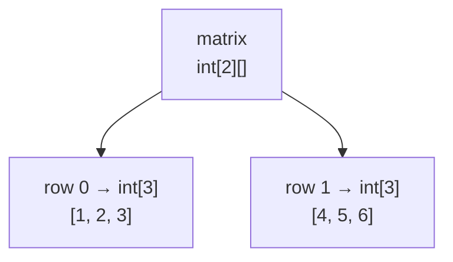

# 🧮 Multi-Dimensional Arrays (2D, Jagged, 3D)

A **2D array** is how you store a **table**: marks of 5 students in 3 subjects, a chessboard, a
seating chart, an image's pixels, a matrix.

```java
int[][] marks = new int[5][3];      // 5 rows (students) × 3 columns (subjects)
```

> 🧠 **The key insight Java beginners miss:** Java has **no real 2D array**. `int[][]` is an
> **array whose elements are themselves `int[]` references**. Everything strange about 2D arrays
> (jagged rows, `matrix[i].length`, `deepToString`, shallow clone) falls straight out of that one
> fact.

---

## 🧠 What It Really Looks Like in Memory

```java
int[][] matrix = {
    {1, 2, 3},
    {4, 5, 6}
};
```

```text
   STACK                 HEAP
 ┌──────────┐      ┌────────────────────┐
 │ matrix ──┼─────▶│  int[2][]  (rows)  │
 └──────────┘      │  ┌──────┬──────┐   │
                   │  │  •   │  •   │   │   ← each slot holds a REFERENCE to a row
                   │  └──┬───┴───┬──┘   │
                   └─────┼───────┼──────┘
                         ▼       ▼
                  ┌───────────┐ ┌───────────┐
                  │ 1 │ 2 │ 3 │ │ 4 │ 5 │ 6 │   ← the rows are separate objects,
                  └───────────┘ └───────────┘     possibly far apart in memory
                    row 0         row 1
```



Consequences:

| Because rows are separate objects… | …you get |
|-----------------------------------|----------|
| Each row has its **own** `length` | `matrix[i].length` (columns of row *i*) vs `matrix.length` (rows) |
| Rows can have **different** lengths | **Jagged arrays** (below) |
| A row can be `null` | `NullPointerException` on `matrix[i][j]` |
| A row can be **swapped whole** | `matrix[0] = matrix[1];` is a single O(1) assignment |
| `clone()` copies row **references** | Shallow copy — see `2_array-operations.md` |

---

## 🔹 Declaration & Creation

```java
// 1. Declare
int[][] matrix;

// 2. Create (rectangular)
matrix = new int[3][4];              // 3 rows × 4 columns, every slot = 0

// 3. Declare + create
int[][] grid = new int[3][4];

// 4. Declare + initialize with values
int[][] table = {
    {1, 2, 3},
    {4, 5, 6},
    {7, 8, 9}
};

// 5. Rows first, columns later (this is what makes jagged arrays possible)
int[][] jag = new int[3][];          // ✅ 3 null rows
jag[0] = new int[2];
jag[1] = new int[5];
jag[2] = new int[1];
```

> ⚠️ `new int[][]` (both sizes missing) → *"array dimension missing"*. The **first** dimension is
> mandatory; later ones may be filled in afterwards.

> ⚠️ `new int[3][]` leaves every row `null` until you assign it. Touch `jag[0][0]` before that
> line and you get a `NullPointerException`, not an out-of-bounds error.

---

## 🎯 Accessing Elements — `[row][column]`

```java
int[][] matrix = {
    {1, 2, 3},
    {4, 5, 6}
};

System.out.println(matrix[1][2]);   // 6   → row 1, column 2
matrix[0][0] = 99;                  // top-left becomes 99
```

```text
                col 0   col 1   col 2
              ┌───────┬───────┬───────┐
      row 0   │   1   │   2   │   3   │   matrix[0][1] = 2
              ├───────┼───────┼───────┤
      row 1   │   4   │   5   │   6   │   matrix[1][2] = 6
              └───────┴───────┴───────┘

  matrix.length     = 2   (number of ROWS)
  matrix[0].length  = 3   (columns IN ROW 0)
```

> ⚠️ **Row first, always.** `matrix[2][1]` on a 2×3 array is out of bounds (there is no row 2), even
> though "column 2, row 1" would have been fine. Java reports it as
> `ArrayIndexOutOfBoundsException: Index 2 out of bounds for length 2`.

> 💡 There is **no `matrix.length` for columns.** Ask the row: `matrix[i].length`. Hard-coding the
> column count is what breaks the moment a row is jagged.

---

## 🔁 Iterating a 2D Array

### Nested classic `for` — the workhorse

```java
for (int i = 0; i < matrix.length; i++) {           // rows
    for (int j = 0; j < matrix[i].length; j++) {    // columns OF THIS ROW  ← not matrix[0].length
        System.out.print(matrix[i][j] + " ");
    }
    System.out.println();                            // newline after each row
}
```

### Nested for-each — when indices don't matter

```java
for (int[] row : matrix) {          // each element of matrix IS an int[]
    for (int value : row) {
        System.out.print(value + " ");
    }
    System.out.println();
}
```

### Printing in one line

```java
System.out.println(Arrays.toString(matrix));       // ❌ [[I@1b6d3586, [I@4554617c
System.out.println(Arrays.deepToString(matrix));   // ✅ [[1, 2, 3], [4, 5, 6]]
```

> 💡 `toString` prints the row *references*; `deepToString` recurses into them. Same reason
> `Arrays.equals` fails on 2D and `deepEquals` works.

### Row-major vs column-major

```java
// ROW-MAJOR (natural, cache-friendly): 1 2 3 4 5 6
for (int i = 0; i < m.length; i++)
    for (int j = 0; j < m[i].length; j++) ...

// COLUMN-MAJOR (walks down each column): 1 4 2 5 3 6
for (int j = 0; j < m[0].length; j++)
    for (int i = 0; i < m.length; i++) ...
```

> ⚠️ Column-major loops **assume every row is the same length** (`m[0].length`). On a jagged array
> they throw. It's also measurably slower on big matrices — each step jumps to a different row
> object instead of walking one contiguous block.

---

## 🪜 Jagged (Ragged) Arrays — rows of different lengths

Perfectly legal, and often the *right* shape: a triangle, a class roster where each student has a
different number of exam attempts, or Pascal's triangle.

```java
int[][] triangle = new int[4][];
for (int i = 0; i < triangle.length; i++) {
    triangle[i] = new int[i + 1];        // row i gets i+1 slots
    Arrays.fill(triangle[i], i + 1);
}
```

```text
row 0 → [1]
row 1 → [2, 2]
row 2 → [3, 3, 3]
row 3 → [4, 4, 4, 4]
```

Or literally:

```java
int[][] jagged = {
    {1},
    {1, 2},
    {1, 2, 3}
};
```

> 💡 A "rectangular" `new int[3][4]` is just a jagged array where Java allocated all the rows for
> you, each with the same length. There is no separate rectangular type.

> ⚠️ Never write `matrix[0].length` as *the* column count unless you created the array rectangular
> yourself. `matrix[i].length` always works.

---

## 🧰 Classic 2D Operations

### Sum of every element / row totals

```java
int total = 0;
for (int i = 0; i < m.length; i++) {
    int rowSum = 0;
    for (int j = 0; j < m[i].length; j++) rowSum += m[i][j];
    System.out.println("Row " + i + " sum = " + rowSum);
    total += rowSum;
}
```

### Diagonals (square matrices only)

```java
int primary = 0, secondary = 0;
int n = m.length;
for (int i = 0; i < n; i++) {
    primary   += m[i][i];              // ↘ top-left → bottom-right
    secondary += m[i][n - 1 - i];      // ↙ top-right → bottom-left
}
```

```text
   ┌───┬───┬───┐        primary   diagonal: i == j
   │ 1̲ │ 2 │ 3̲ │        secondary diagonal: i + j == n-1
   ├───┼───┼───┤
   │ 4 │ 5̲ │ 6 │        primary   = 1 + 5 + 9 = 15
   ├───┼───┼───┤        secondary = 3 + 5 + 7 = 15
   │ 7̲ │ 8 │ 9̲ │
   └───┴───┴───┘
```

### Transpose (flip rows ↔ columns)

```java
static int[][] transpose(int[][] m) {
    int[][] t = new int[m[0].length][m.length];        // dimensions SWAP
    for (int i = 0; i < m.length; i++)
        for (int j = 0; j < m[i].length; j++)
            t[j][i] = m[i][j];
    return t;
}
```
For a **square** matrix you can do it in place — but only loop the upper triangle (`j = i + 1`),
otherwise every element gets swapped twice and nothing changes:

```java
for (int i = 0; i < n; i++)
    for (int j = i + 1; j < n; j++) {
        int t = m[i][j]; m[i][j] = m[j][i]; m[j][i] = t;
    }
```

### Matrix addition & multiplication

```java
// ADD — same dimensions required, element-wise
c[i][j] = a[i][j] + b[i][j];

// MULTIPLY — a is (n × m), b must be (m × p), result is (n × p)
for (int i = 0; i < n; i++)
    for (int j = 0; j < p; j++) {
        int sum = 0;
        for (int k = 0; k < m; k++) sum += a[i][k] * b[k][j];
        c[i][j] = sum;
    }
```

> 💡 Multiplication is **O(n³)** and needs `a.columns == b.rows`. Check that first — it's the
> question the interviewer is really asking.

---

## 🧊 3D and Beyond

```java
int[][][] cube = new int[2][3][4];    // 2 blocks × 3 rows × 4 columns = 24 ints
cube[1][2][3] = 7;

for (int[][] block : cube)
    for (int[] row : block)
        for (int v : row) { … }
```

> 💡 Java allows any number of dimensions, but **past 3 you almost always want objects instead**
> (`Student[]` beats `int[][][]` where dimension 3 means "which exam"). If you cannot name what each
> dimension *means*, the design is wrong.

---

## 🌍 Where 2D Arrays Show Up in Real Code

| Use case | Shape |
|----------|-------|
| Tic-tac-toe / chess / Sudoku board | `char[3][3]`, `int[9][9]` |
| Grayscale image | `int[height][width]` (pixel intensity) |
| Marks / spreadsheet / report table | `int[students][subjects]` |
| Graph adjacency matrix | `boolean[n][n]` |
| Dynamic-programming tables | `int[n+1][target+1]` |
| Seat booking, calendars, grids in games | `boolean[rows][cols]` |

---

## 🐞 Common Errors

| Error / bug | Cause |
|-------------|-------|
| `ArrayIndexOutOfBoundsException` on the **row** index | Swapped `[row][col]` order |
| `NullPointerException` on `m[i][j]` | Row never created (`new int[3][]` and no row assigned) |
| `[[I@1b6d3586` printed | Used `toString` instead of **`deepToString`** |
| `Arrays.equals(a, b)` returns `false` for identical matrices | Needs **`deepEquals`** |
| Editing a "copy" changes the original | `clone()` on 2D is **shallow** — clone each row |
| Column loop crashes on some rows | Used `m[0].length` on a **jagged** array |
| In-place transpose does nothing | Inner loop started at `0` instead of `i + 1` |
| *array dimension missing* | `new int[][]` with no first size |

---

## 🗂️ Where to Practise This

Chapter 4's `coding-practice/` is all 1D, so build these yourself — they are the standard set:

| Exercise | Skill it drills |
|----------|-----------------|
| Read an `m × n` matrix and print it as a grid | Nested input loops, formatting |
| Row-wise and column-wise sums | `m[i].length` vs `m.length` |
| Sum of both diagonals | Index relationships (`i == j`, `i + j == n-1`) |
| Transpose (new array **and** in place) | Dimension swapping, upper-triangle loop |
| Matrix addition & multiplication | Dimension compatibility, triple loop |
| Find the largest element and its `[row][col]` | Tracking two indices at once |
| Spiral / boundary traversal of a matrix | Four-pointer boundary shrinking (interview favourite) |
| Pascal's triangle | Jagged allocation |

> 💡 Your nested-loop pattern programs in
> `chapter2-java-operators-and-control-flow/coding-practice/pattern_*` are the same muscle — a 2D
> array is just a pattern loop that **stores** instead of prints.

---

## 🎯 Key Takeaways

- `int[][]` is an **array of array references** — Java has no true rectangular 2D array.
- `matrix.length` = rows; **`matrix[i].length`** = columns of row *i* (never hard-code it).
- Always index **`[row][column]`**.
- `new int[3][]` is legal and gives you **`null` rows** — that's how **jagged** arrays are built.
- Print with **`Arrays.deepToString`**, compare with **`Arrays.deepEquals`**.
- `clone()` on a 2D array is **shallow** — the rows stay shared.
- Rectangular assumptions (`m[0].length`, column-major loops) break on jagged data.
- In-place transpose must loop the **upper triangle** only.
- 👉 Next: **`4_searching-and-sorting.md`** — linear vs binary search, and the three classic sorts.
