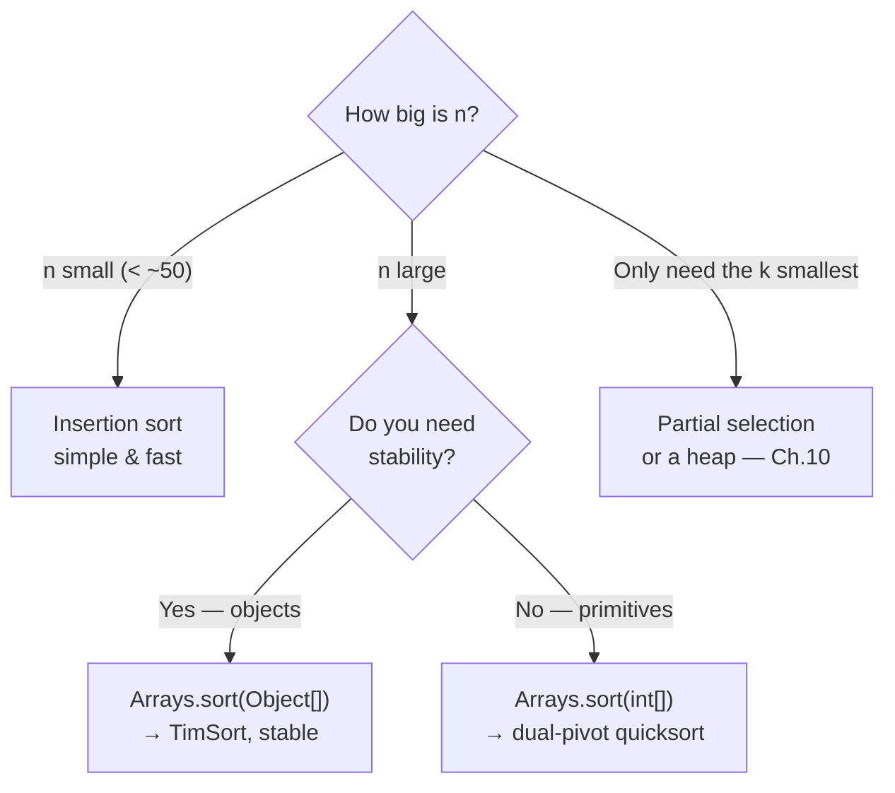

# 🔍 Searching & Sorting Arrays

Two questions get asked of almost every array ever written:

1. **"Is X in here, and where?"** → searching
2. **"Put these in order."** → sorting

This file covers the two searches and three sorts you are expected to be able to write **from
memory**, plus what Java's own `Arrays.sort` actually does.

---

## 🕵️ Linear Search — check every element

The only option when the array is **unsorted**.

```java
public static int linearSearch(int[] arr, int key) {
    for (int i = 0; i < arr.length; i++) {
        if (arr[i] == key) return i;      // found → return the INDEX
    }
    return -1;                            // not found → the universal "no" signal
}
```

```text
key = 30
  ┌────┬────┬────┬────┬────┐
  │ 10 │ 50 │ 30 │ 20 │ 40 │
  └────┴────┴────┴────┴────┘
    ✗    ✗    ✓  ← found at index 2, stop
```

| | |
|---|---|
| Best case | **O(1)** — first element |
| Worst / not found | **O(n)** — every element |
| Needs sorted input | ❌ No |
| Extra memory | O(1) |

> 💡 **Return the index, not `true`/`false`.** `-1` means "absent" and any real index is `>= 0`, so
> the caller gets both answers from one value. `coding_1/ArrayBasics.java` does exactly this with
> `findElement`, then prints `position + 1` for a human-friendly "position".

> ⚠️ Use `return` inside the loop, not a `found = true` flag that keeps scanning. And for `String`
> or object elements, compare with `.equals()` — `==` compares addresses (Chapter 5).

---

## ⚡ Binary Search — halve the range each step

**Prerequisite: the array must be sorted.** That is not a suggestion — on unsorted input binary
search returns a confidently wrong answer with no exception.

<p align="center">
  
</p>

```java
public static int binarySearch(int[] arr, int key) {
    int low = 0, high = arr.length - 1;

    while (low <= high) {                       // <=  because low == high is still a live range
        int mid = low + (high - low) / 2;       // overflow-safe midpoint

        if (arr[mid] == key)      return mid;   // hit
        else if (arr[mid] < key)  low  = mid + 1;   // target is in the RIGHT half
        else                      high = mid - 1;   // target is in the LEFT half
    }
    return -1;
}
```

### Trace: find `23` in `{2, 5, 8, 12, 16, 23, 38, 56, 72, 91}`

| Step | low | high | mid | `arr[mid]` | Decision |
|------|-----|------|-----|-----------|----------|
| 1 | 0 | 9 | 4 | 16 | `16 < 23` → search right → `low = 5` |
| 2 | 5 | 9 | 7 | 56 | `56 > 23` → search left → `high = 6` |
| 3 | 5 | 6 | 5 | 23 | ✅ **found at index 5** |

```text
step 1:  [2  5  8  12 (16) 23 38 56 72 91]     ← discard the whole left half
step 2:              [23  38 (56) 72  91]      ← discard the right half
step 3:              [(23) 38]                 ← found
```

Ten elements, **three** comparisons. That gap explodes with size:

| Array size | Linear (worst) | Binary (worst) |
|-----------|----------------|----------------|
| 10 | 10 | 4 |
| 1,000 | 1,000 | 10 |
| 1,000,000 | 1,000,000 | **20** |
| 1,000,000,000 | 1 billion | **30** |

Every doubling of the data adds exactly **one** step. That is what **O(log n)** feels like.

### Recursive form (same logic, one frame per step)

```java
public static int binarySearch(int[] arr, int low, int high, int key) {
    if (low > high) return -1;                                  // base case: empty range
    int mid = low + (high - low) / 2;

    if (arr[mid] == key)     return mid;
    if (arr[mid] < key)      return binarySearch(arr, mid + 1, high, key);
    else                     return binarySearch(arr, low, mid - 1, key);
}
```
> 💡 This is **tail recursion** — and Java does not optimise it (`chapter3/3_recursion.md`). The
> iterative version uses O(1) memory instead of O(log n) stack frames. Depth is tiny either way, so
> pick whichever reads better to you.

### 🐛 Three bugs that live inside binary search

| Bug | Symptom | Fix |
|-----|---------|-----|
| `while (low < high)` | Misses the element when the range narrows to one | Use **`<=`** |
| `low = mid` / `high = mid` | **Infinite loop** — the range stops shrinking | Use `mid + 1` / `mid - 1` |
| `int mid = (low + high) / 2;` | Overflows to **negative** for huge arrays → `ArrayIndexOutOfBoundsException` | `low + (high - low) / 2` |

> ⚠️ That last one is famous: the JDK's own `Arrays.binarySearch` shipped with it for **nine years**
> before it was found in 2006. It only bites when `low + high > 2,147,483,647`, i.e. arrays above
> ~1 billion elements — so it never shows up in practice code, only in production and interviews.
> `coding_15/BinarySearch.java` currently uses `(low + high) / 2`; changing it to
> `low + (high - low) / 2` costs nothing and is strictly correct.

### The library version

```java
Arrays.sort(arr);                              // ALWAYS sort first
int idx = Arrays.binarySearch(arr, 23);
```

> 💡 A **negative** return isn't just "not found" — it encodes where the key *would* go:
> `-(insertionPoint) - 1`. So `-3` means "absent, and it belongs at index 2". Recover it with
> `int insertAt = -(idx + 1);`.

### Linear vs Binary

| | Linear | Binary |
|---|---|---|
| Sorted input required | ❌ No | ✅ **Yes** |
| Time | O(n) | O(log n) |
| Good for | Small or unsorted data, one-off lookups | Large sorted data, repeated lookups |
| Cost of preparing | None | Sorting is O(n log n) |

> ⚠️ Sorting **just to run one search** is slower than a linear scan (O(n log n) > O(n)). Sorting
> pays off when you will search **many times**, or when you need the order anyway.

---

## 🫧 Bubble Sort — bubble the biggest to the end

<p align="center">
  
</p>

Compare **adjacent pairs** and swap if they are out of order. After pass 1, the largest element has
travelled all the way to the end; after pass 2, the second largest; and so on.

```java
public static void bubbleSort(int[] arr) {
    for (int i = 0; i < arr.length - 1; i++) {          // n-1 passes
        boolean swapped = false;
        for (int j = 0; j < arr.length - i - 1; j++) {  // -i skips the sorted tail
            if (arr[j] > arr[j + 1]) {
                int temp = arr[j];
                arr[j]     = arr[j + 1];
                arr[j + 1] = temp;
                swapped = true;
            }
        }
        if (!swapped) break;         // ✅ already sorted → stop early (best case O(n))
    }
}
```

### Pass-by-pass on `{5, 1, 4, 2}`

```text
Pass 1:  (5 1) 4 2 → 1 5 4 2      swap
          1 (5 4) 2 → 1 4 5 2      swap
          1 4 (5 2) → 1 4 2 5      swap   🔒 5 is locked at the end
Pass 2:  (1 4) 2 5 → 1 4 2 5      no swap
          1 (4 2) 5 → 1 2 4 5      swap   🔒 4 locked
Pass 3:  (1 2) 4 5 → no swap → swapped == false → BREAK ✅
```

| | |
|---|---|
| Best (already sorted) | **O(n)** — thanks to the `swapped` flag |
| Average / worst | **O(n²)** |
| Swaps | Many (up to n²/2) |
| Space | O(1), in place |
| **Stable** | ✅ Yes (equal elements keep their relative order) |

> 💡 The two details that make this a *good* bubble sort — and that `coding_16/BubbleSort.java`
> gets right — are the **`- i`** in the inner bound (never re-check the sorted tail) and the
> **`swapped` flag** (turns the best case from O(n²) into O(n)).

---

## 🎯 Selection Sort — find the minimum, put it in place

<p align="center">
  
</p>

Scan the unsorted region for the **smallest** element and swap it into position `i`. Exactly **one
swap per pass**.

```java
public static void selectionSort(int[] arr) {
    for (int i = 0; i < arr.length - 1; i++) {
        int minIndex = i;
        for (int j = i + 1; j < arr.length; j++) {
            if (arr[j] < arr[minIndex]) minIndex = j;    // remember WHERE, don't swap yet
        }
        if (minIndex != i) {                             // skip a pointless self-swap
            int temp = arr[i];
            arr[i]        = arr[minIndex];
            arr[minIndex] = temp;
        }
    }
}
```

```text
{64, 25, 12, 22, 11}
i=0: min is 11 → swap 64↔11 → [11 | 25, 12, 22, 64]
i=1: min is 12 → swap 25↔12 → [11, 12 | 25, 22, 64]
i=2: min is 22 → swap 25↔22 → [11, 12, 22 | 25, 64]
i=3: min is 25 → already there → [11, 12, 22, 25, 64] ✅
                                  └─ sorted ─┘ └ unsorted ┘
```

| | |
|---|---|
| Best / average / worst | **O(n²) always** — the scan never shortens |
| Swaps | **≤ n-1** — the fewest of any simple sort |
| Space | O(1), in place |
| **Stable** | ❌ No (a long-range swap can jump equal elements past each other) |

> 💡 Selection sort's one real advantage: when a *write* is expensive (flash memory, huge records),
> n-1 swaps beats bubble sort's thousands.

> ⚠️ **Bug alert in `coding_17/SelectionSort.java`.** It carries a `swapped` flag copied from bubble
> sort and does `if (!swapped) break;`. In selection sort that flag only means *"no smaller element
> was found in **this** pass"* — which does **not** mean the array is sorted. Try `{1, 3, 2}`:
> pass `i=0` finds nothing smaller than `1`, sets `swapped = false`, and **breaks — leaving
> `{1, 3, 2}` unsorted.** The early-exit trick belongs to bubble sort only; delete the flag here.

---

## 📥 Insertion Sort — like sorting a hand of cards

<p align="center">
  
</p>

Take the next element and **slide it backwards** into its correct spot among the already-sorted
part.

```java
public static void insertionSort(int[] arr) {
    for (int i = 1; i < arr.length; i++) {      // start at 1: arr[0] alone is "sorted"
        int key = arr[i];
        int j = i - 1;

        while (j >= 0 && arr[j] > key) {        // shift bigger elements one step right
            arr[j + 1] = arr[j];
            j--;
        }
        arr[j + 1] = key;                       // drop the key into the gap
    }
}
```

```text
{12, 11, 13, 5}
i=1: key=11 → 12 shifts right → [11, 12, 13, 5]
i=2: key=13 → already bigger, no shift → [11, 12, 13, 5]
i=3: key=5  → 13,12,11 all shift → [5, 11, 12, 13] ✅
```

| | |
|---|---|
| Best (nearly sorted) | **O(n)** — the `while` exits immediately |
| Average / worst | O(n²) |
| Space | O(1), in place |
| **Stable** | ✅ Yes |

> 💡 Insertion sort is the **fastest of the three on small or nearly-sorted data** — which is why
> real library sorts (including Java's) switch to it for sub-arrays under ~32–47 elements.

---

## 📊 The Three Sorts, Side by Side

| | Bubble | Selection | Insertion |
|---|---|---|---|
| Best | O(n) *(with flag)* | O(n²) | **O(n)** |
| Average | O(n²) | O(n²) | O(n²) |
| Worst | O(n²) | O(n²) | O(n²) |
| Swaps / writes | Highest | **Lowest (n-1)** | Medium |
| Space | O(1) | O(1) | O(1) |
| Stable | ✅ | ❌ | ✅ |
| Shines when | Teaching; detecting "already sorted" | Writes are expensive | Data is small or nearly sorted |

**Stability** = two equal keys keep their original relative order. It is invisible with `int`s and
critical the moment you sort *records*: sort employees by name, then by department — a stable sort
keeps the name order inside each department.



---

## 🏭 What `Arrays.sort` Actually Does

```java
Arrays.sort(arr);                      // whole array, ascending, IN PLACE
Arrays.sort(arr, 2, 5);                // indices 2..4 only (to is exclusive)
```

| Input type | Algorithm | Complexity | Stable? |
|-----------|-----------|------------|---------|
| Primitives (`int[]`, `double[]`, …) | **Dual-pivot quicksort** | O(n log n) average | ❌ Not stable — *and it doesn't matter*: two equal `int`s are indistinguishable |
| Objects (`Integer[]`, `String[]`, …) | **TimSort** (merge + insertion hybrid) | O(n log n) worst | ✅ Stable — required, because equal objects can differ in other fields |

> 💡 That split is a deliberate design decision, and a great interview answer: primitives get the
> faster in-place algorithm because stability is meaningless for them; objects get the stable one
> because it is observable.

> ⚠️ `Arrays.sort` **mutates the array you pass in** — the caller's data is reordered permanently
> (pass-by-value on a shared reference, file 1). Sort a `clone()` if you still need the original
> order. Note that `coding_15`, `coding_18` and `coding_19` all sort the user's input before working
> on it, so any "position" they report refers to the **sorted** array, not the typed order.

> 💡 Descending order needs boxed objects — there is no `Arrays.sort(int[], reverseOrder())`:
> ```java
> Integer[] a = {3, 1, 2};
> Arrays.sort(a, Collections.reverseOrder());   // [3, 2, 1]   (Chapters 9 & 10)
> ```

### Beyond this chapter

| Algorithm | Time | Note |
|-----------|------|------|
| **Merge sort** | O(n log n) always | Stable, needs O(n) extra space, divide & conquer |
| **Quick sort** | O(n log n) avg, O(n²) worst | In place, fastest in practice |
| **Heap sort** | O(n log n) always | In place, not stable |
| **Counting sort** | O(n + k) | No comparisons — only for small integer ranges |

You will meet these in Chapter 10 and in DSA practice. The three sorts above are the foundation they
are all built on.

---

## 🐞 Common Mistakes

| Mistake | Result |
|---------|--------|
| Binary search on unsorted data | Wrong answer, **no error** |
| `while (low < high)` | Misses single-element ranges |
| `low = mid` instead of `mid + 1` | Infinite loop |
| `(low + high) / 2` on huge arrays | Negative index → exception |
| Inner loop `j <= arr.length - i - 1` | `arr[j+1]` runs off the end |
| Bubble sort without the `- i` | Correct but wastes half the comparisons |
| Selection sort with a `swapped` break | **Leaves the array unsorted** (see above) |
| Swapping without a `temp` | `a = b; b = a;` loses a value |
| Returning `true`/`false` from a search | Caller loses the position |
| Sorting inside a "find" method | Silently reorders the caller's data |

---

## 🗂️ Where to Practise This

| Concept | File in `coding-practice/` |
|---------|---------------------------|
| Linear search | `coding_1/ArrayBasics.java` (`findElement`) |
| Checking sorted order | `coding_5/CheckIfArraySortedInAscending.java` |
| Second largest without sorting | `coding_6/FindSecondLargest.java` |
| Binary search (iterative, with `Arrays.sort` first) | `coding_15/BinarySearch.java` |
| Bubble sort with early exit | `coding_16/BubbleSort.java` |
| Selection sort | `coding_17/SelectionSort.java` |
| Sort-then-scan for gaps | `coding_18/FindMissingNumbers.java` |

---

## 🎯 Key Takeaways

- **Linear search**: O(n), works on anything. **Binary search**: O(log n), demands a **sorted**
  array.
- Return **`-1`** for "not found" so one `int` carries both answers.
- Binary search's three landmines: `<=`, `mid ± 1`, and `low + (high - low) / 2`.
- A billion elements = **30** binary-search steps. Logarithms are magic.
- **Bubble** = swap neighbours (add the `swapped` flag for O(n) best case).
  **Selection** = pick the min, one swap per pass (**never** add a `swapped` break).
  **Insertion** = slide each element back into place (best on nearly-sorted data).
- All three are **O(n²) average, O(1) space, in place**; only selection sort is unstable.
- **Stability** matters when sorting objects by more than one field.
- `Arrays.sort` = **dual-pivot quicksort** for primitives, **TimSort** for objects — and it mutates
  your array.
- 👉 Next: **`5_array-problem-patterns.md`** — the reusable techniques behind every array interview
  question.

---

<sub>Animations from <a href="https://commons.wikimedia.org/">Wikimedia Commons</a> (CC BY-SA / public domain).</sub>
