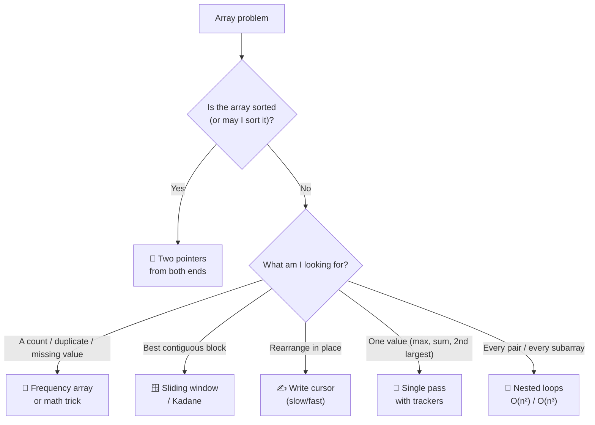

# 🧩 Array Problem Patterns — the 8 Techniques Behind Every Question

There are hundreds of array questions and roughly **eight ideas**. Once you can name the pattern, the
code writes itself. Every pattern below is already sitting in your `coding-practice/` folder — this
file gives each one its name, its shape, and its cost.



---

## 1️⃣ Single Pass with Trackers

**Idea:** carry one or two "best so far" variables through **one** loop instead of looping twice.

```java
// max, min and sum in ONE pass
int max = arr[0], min = arr[0], sum = 0;
for (int value : arr) {
    if (value > max) max = value;
    if (value < min) min = value;
    sum += value;
}
```

**Second largest** — the classic "two trackers" version, O(n) with no sorting:

```java
int largest = Integer.MIN_VALUE, second = Integer.MIN_VALUE;
for (int value : arr) {
    if (value > largest)      { second = largest; largest = value; }   // order matters!
    else if (value > second && value != largest) { second = value; }   // skip duplicates
}
```

> ⚠️ **Never initialise `max = 0`.** On `{-5, -2, -9}` the answer comes back `0`, which isn't even
> in the array. Start from `arr[0]` (best) or `Integer.MIN_VALUE`.

> ⚠️ Sorting to find the second largest is O(n log n) *and* destroys the caller's order. One pass is
> O(n). Interviewers ask this exact question to see if you reach for `sort` reflexively.

📂 `coding_1/ArrayBasics.java` · `coding_4/SignCounter.java` · `coding_5/CheckIfArraySortedInAscending.java` · `coding_6/FindSecondLargest.java`

---

## 2️⃣ Two Pointers (from both ends)

**Idea:** one pointer at the start, one at the end, walking toward each other. **O(n) time, O(1)
space.**

```java
int i = 0, j = arr.length - 1;
while (i < j) {
    // decide: move i, move j, or both
}
```

### Use A — reverse / palindrome check

```java
public static boolean isPalindrome(int[] arr) {
    for (int i = 0, j = arr.length - 1; i < j; i++, j--) {
        if (arr[i] != arr[j]) return false;    // one mismatch is enough
    }
    return true;
}
```
```text
[1, 2, 3, 2, 1]
 i↑         ↑j    1 == 1 ✓
    i↑   ↑j       2 == 2 ✓
       i=j        stop → palindrome ✅
```

### Use B — pair with a given sum (**sorted** array)

```java
Arrays.sort(arr);
int left = 0, right = arr.length - 1;
while (left < right) {
    int sum = arr[left] + arr[right];
    if (sum == target)      { System.out.println(arr[left] + " + " + arr[right]);  left++; right--; }
    else if (sum < target)  left++;      // need a BIGGER sum → move the small end up
    else                    right--;     // need a SMALLER sum → move the big end down
}
```

Why it works: because the array is sorted, a sum that's too small can *only* be fixed by moving
`left` right — so no pair is ever skipped. That turns the brute-force **O(n²)** double loop into
**O(n)** (plus the O(n log n) sort).

### Use C — partition by a condition

`coding_14` pushes negatives left and positives right by swapping mismatched pairs from the outside
in — the same skeleton, different decision rule.

📂 `coding_7/ArrayReverse.java` · `coding_14/ArrangeNegativeAndPositiveNumbers.java` · `coding_20/FindPairsWhoseSumIs.java` · `coding_22/ArrayPalindrome.java`

---

## 3️⃣ The Write Cursor (slow / fast pointer)

**Idea:** one **fast** pointer reads every element; one **slow** pointer marks where the next *kept*
element should be written. Perfect for "filter/compact this array **in place**".

```java
// Move all zeroes to the end, keeping the order of the rest
public static void moveZeroes(int[] arr) {
    int write = 0;                                  // slow: next slot for a non-zero
    for (int read = 0; read < arr.length; read++) { // fast: scans everything
        if (arr[read] != 0) {
            int temp = arr[write]; arr[write] = arr[read]; arr[read] = temp;
            write++;
        }
    }
}
```

```text
[0, 1, 0, 3, 12]
 read=0 → 0, skip            write=0  [0, 1, 0, 3, 12]
 read=1 → 1, swap w/ idx0    write=1  [1, 0, 0, 3, 12]
 read=2 → 0, skip                     [1, 0, 0, 3, 12]
 read=3 → 3, swap w/ idx1    write=2  [1, 3, 0, 0, 12]
 read=4 → 12, swap w/ idx2   write=3  [1, 3, 12, 0, 0] ✅
```

The same skeleton removes duplicates from a **sorted** array — keep an element only if it differs
from the last one written:

```java
public static int removeDuplicates(int[] arr) {
    int write = 0;
    for (int read = 1; read < arr.length; read++) {
        if (arr[read] != arr[write]) arr[++write] = arr[read];
    }
    return write + 1;                 // NEW LOGICAL SIZE — the array itself is still full length
}
```

> 💡 **The returned size is the whole point.** The array keeps its original `length` with stale
> values past the cursor, so the caller must print `0 … size-1`. That is exactly what
> `coding_9/DuplicateRemover.java` returns with `j + 1`.

> ⚠️ `DuplicateRemover` sorts first (order lost, O(n log n)); `DuplicateRemoverWithoutLosingOrder`
> keeps the order by rescanning the kept region — correct, but **O(n²)**. A `HashSet` does it in
> O(n) while keeping order (Chapter 10). All three are worth knowing; each trades something.

📂 `coding_9/DuplicateRemover*.java` · `coding_13/ShiftZero.java`

---

## 4️⃣ Frequency / Counting Array (hashing by index)

**Idea:** when values are small non-negative integers, **use the value itself as an index**. Counting
becomes O(1) per element.

```java
int[] freq = new int[100];              // works for values 0..99
for (int value : arr) freq[value]++;    // 👈 the whole trick

for (int v = 0; v < freq.length; v++)
    if (freq[v] > 0) System.out.println(v + " occurs " + freq[v] + " time(s)");
```

```text
arr  = [3, 1, 3, 2, 1, 3]
freq =  index: 0  1  2  3
        count: 0  2  1  3     ← one pass, O(n)
```

| Approach | Time | Space | Keeps order? |
|----------|------|-------|--------------|
| Nested loops (count each element) | O(n²) | O(1) | ✅ |
| **Sort, then count runs** ← `coding_8` | O(n log n) | O(1) | ❌ order lost |
| **Frequency array** | **O(n)** | O(k) | ✅ |
| `HashMap<Integer,Integer>` (Ch. 10) | O(n) | O(n) | ✅ with `LinkedHashMap` |

> ⚠️ A frequency array needs a **known, small, non-negative** value range. Negative values or values
> in the millions blow it up (`new int[1_000_000_000]` → `OutOfMemoryError`). Offset negatives with
> `freq[value - min]++`, or switch to a `HashMap`.

> ⚠️ **`coding_19` (first repeating / first non-repeating) sorts the array first — which destroys
> the meaning of "first".** On `{5, 2, 5, 3, 2, 9}` the true first non-repeating element is `3`, but
> after sorting the scan reports `9`. Fix: count frequencies **without** sorting (frequency array or
> `HashMap`), then walk the **original** array and return the first value whose count is `1`.

📂 `coding_8/FreqCounter.java` · `coding_19/RepeatingNonRepeatingElements.java`

---

## 5️⃣ Math & Bit Tricks (O(n) time, O(1) space)

### Missing number from `1..n`

```java
// Sum formula: what SHOULD the total be, minus what it IS
int expected = n * (n + 1) / 2;
int actual   = 0;
for (int v : arr) actual += v;
int missing  = expected - actual;         // one pass, no sorting, no extra array
```

```java
// XOR version — immune to integer overflow
int xor = 0;
for (int i = 1; i <= n; i++)   xor ^= i;
for (int v : arr)              xor ^= v;   // every present value cancels itself out
// xor == the missing number
```

Why XOR works: `x ^ x == 0` and `x ^ 0 == x`, so every number appearing **twice** (once in `1..n`,
once in the array) cancels, leaving only the one that appeared once. It also finds the single
non-duplicated element in `{2,3,2,4,4}` — a favourite interview question.

> 💡 You already met `^` in `chapter2/1_operators.md`. This is where it stops being trivia.

> ⚠️ **`coding_18/FindMissingNumbers.java` solves a slightly different problem than the question
> states.** It sorts, then reports gaps *between consecutive present values* — so for
> `{2, 3, 5}` with n = 6 it finds `4` but misses `1` and `6`, because there is no neighbour on the
> outside to form a gap. To answer "missing from 1..n", either use the formula above (single
> missing) or a `boolean[] seen = new boolean[n + 1]` and report every index never marked (multiple
> missing).

📂 `coding_18/FindMissingNumbers.java`

---

## 6️⃣ Running Window / Kadane's Algorithm

**Idea:** track a **current run** and a **best run**; extend or restart at each step. One pass, O(1)
memory.

### Longest increasing contiguous run

```java
int bestStart = 0, bestEnd = 0, currStart = 0;
for (int i = 1; i < arr.length; i++) {
    if (arr[i] <= arr[i - 1]) {                       // the run breaks here
        if (i - 1 - currStart > bestEnd - bestStart) { bestStart = currStart; bestEnd = i - 1; }
        currStart = i;                                // start a new run
    }
}
// ⚠️ check the final run too — it never hits the "break" branch
```

> ⚠️ **The tail case is the bug everyone ships.** If the array ends while still increasing, the
> comparison inside the loop never runs for that last run. `coding_24` handles it with an explicit
> check after the loop — copy that habit into every windowing problem.

### Kadane — maximum contiguous subarray sum

The question: which contiguous block has the biggest total? Brute force checks all O(n²) subarrays;
Kadane answers in **one pass**.

```java
int maxSoFar = arr[0], maxEndingHere = arr[0];
for (int i = 1; i < arr.length; i++) {
    maxEndingHere = Math.max(arr[i], maxEndingHere + arr[i]);   // extend, or restart at i
    maxSoFar      = Math.max(maxSoFar, maxEndingHere);          // remember the best ever
}
```

```text
arr = [-2, 1, -3, 4, -1, 2, 1, -5, 4]

 i:            0    1    2    3    4    5    6    7    8
 value:       -2    1   -3    4   -1    2    1   -5    4
 endingHere:  -2    1   -2    4    3    5    6    1    5
 soFar:       -2    1    1    4    4    5    6    6    6   ← answer = 6  ([4,-1,2,1])
                                  restart at 4 because
                                  -2 + 4 < 4 → carrying the past hurt
```

> 🧠 **The one-line intuition:** *"if the sum I'm carrying is dragging me down, drop it and start
> fresh."* That single decision is the whole algorithm.

> ⚠️ Initialise from `arr[0]`, **not `0`**. With `maxSoFar = 0`, an all-negative array like
> `{-3, -1, -7}` wrongly returns `0` instead of `-1`.

📂 `coding_21/KadaneAlgo.java` · `coding_24/LongestContiguousSubarray.java`

---

## 7️⃣ Nested-Loop Enumeration (all pairs / all subarrays)

Sometimes you genuinely must look at every combination.

```java
// ALL PAIRS — O(n²).  j = i + 1 avoids self-pairs and duplicates
for (int i = 0; i < n; i++)
    for (int j = i + 1; j < n; j++) { … }

// ALL SUBARRAYS — n(n+1)/2 of them; printing each costs another loop → O(n³)
for (int i = 0; i < n; i++)              // start
    for (int j = i; j < n; j++) {        // end
        for (int k = i; k <= j; k++)     // print
            System.out.print(arr[k] + " ");
    }
```

```text
[1, 2, 3] → {1} {1,2} {1,2,3} {2} {2,3} {3}      = 3·4/2 = 6 subarrays
```

> 💡 **Subarray vs subsequence vs subset:** a *subarray* is contiguous (n(n+1)/2 of them), a
> *subsequence* keeps order but may skip (2ⁿ), a *subset* ignores order (2ⁿ). Interviewers swap the
> words deliberately — ask which one they mean.

> 💡 Running sums let you drop the third loop: keep `sum += arr[j]` as `j` extends, and every
> subarray total is available in **O(n²)** instead of O(n³). That idea generalises to **prefix
> sums**, where `prefix[j+1] - prefix[i]` gives any range total in O(1).

📂 `coding_20/FindPairsWhoseSumIs.java` · `coding_23/SubArrays.java`

---

## 8️⃣ In-Place Rearrangement

**Idea:** the answer isn't a value — it's a **new arrangement** of the same elements. Aim for O(1)
extra space.

### Wave sort — `a[0] ≤ a[1] ≥ a[2] ≤ a[3] …`

```java
for (int i = 0; i < arr.length - 1; i++) {
    if (i % 2 == 0) { if (arr[i] > arr[i + 1]) swap(arr, i, i + 1); }   // even index: dip
    else            { if (arr[i] < arr[i + 1]) swap(arr, i, i + 1); }   // odd index: peak
}
```

```text
[10, 5, 6, 3, 2, 20]  →  [5, 10, 3, 6, 2, 20]

  10 ●         ●20        the shape literally waves:
     ╲       ╱            even indices are valleys,
   5 ●─●6  ╱              odd indices are peaks
        ╲●3 ●2
```
Only **one pass, no sorting** — because fixing each adjacent pair left-to-right can never break the
pair behind it.

### Alternate signs

`coding_25` walks the array, finds the next element of the opposite sign, and **rotates it into
place** (shifting everything in between) — which preserves relative order at the cost of O(n²) in
the worst case. The O(n) alternative sacrifices order: collect positives and negatives into two
arrays and interleave them, O(n) time with O(n) space. **Pick your trade deliberately, and say which
one you chose.**

📂 `coding_25/AlternateSign.java` · `coding_26/WaveFormSorting.java`

---

## 🗺️ Pattern Picker — problem ➜ technique

| The question says… | Reach for |
|--------------------|-----------|
| "max / min / sum / count of…" | Single pass with trackers |
| "pair that sums to…", "is it a palindrome", "reverse it" | Two pointers from both ends |
| "remove / move / partition **in place**, keep order" | Write cursor (slow/fast) |
| "how many times does each…", "first repeating / non-repeating" | Frequency array or `HashMap` |
| "the missing number", "the one that appears once" | Sum formula or XOR |
| "longest / maximum **contiguous**…" | Running window / Kadane |
| "all pairs", "all subarrays" | Nested loops (+ running sums to drop a level) |
| "rearrange so that…" | In-place rearrangement |
| "sorted array" appears anywhere in the prompt | Two pointers **or** binary search — never a linear scan |

---

## ⏱️ The Complexity Ladder

| Class | Name | n = 1,000 → roughly | Typical array cause |
|-------|------|--------------------|---------------------|
| O(1) | Constant | 1 | `arr[i]`, `arr.length` |
| O(log n) | Logarithmic | 10 | Binary search |
| **O(n)** | Linear | 1,000 | One loop — **the target for most problems** |
| O(n log n) | Linearithmic | 10,000 | `Arrays.sort` |
| O(n²) | Quadratic | 1,000,000 | Nested loops, bubble/selection sort |
| O(n³) | Cubic | 1,000,000,000 | Triple loops (all subarrays, matrix multiply) |
| O(2ⁿ) | Exponential | ☠️ | All subsequences, naive recursion |

> 💡 **How to read your own code:** count the **nested loops over the data**. Two loops where the
> inner one restarts each time = O(n²); two pointers that only ever move forward = O(n), even though
> there are two of them. Sorting inside a loop is the classic accidental O(n² log n).

---

## 🐞 The Bugs This Chapter Keeps Producing

| Bug | Where it bites |
|-----|----------------|
| `max = 0` instead of `arr[0]` | All-negative arrays |
| Forgetting the **final run/window** after the loop | Longest-run problems |
| `maxSoFar = 0` in Kadane | All-negative arrays |
| Sorting when the question says "**first**" | Destroys the original order (`coding_19`) |
| Using `arr.length` after an in-place compaction | Prints stale tail values |
| `i <= arr.length` | `ArrayIndexOutOfBoundsException` |
| `arr[i + 1]` with `i` running to `length - 1` | Off-by-one on the last iteration |
| Two-pointer loop with `i <= j` | Compares the middle element with itself |
| Frequency array sized by `n` instead of `maxValue + 1` | Out of bounds when values exceed the count |

---

## 🎯 Key Takeaways

- Eight patterns cover almost every array question. **Name the pattern before writing code.**
- **Single pass** beats sorting whenever you only need one or two values (second largest is O(n)).
- **Two pointers** turn O(n²) into O(n) — the moment the array is sorted, they are the default.
- **Write cursor** = in-place filtering; always return the **logical size**.
- **Frequency arrays** trade O(k) memory for O(1) counting — only for small, non-negative ranges.
- **Sum formula / XOR** answer "missing" and "appears once" in O(n) with no extra memory.
- **Kadane** = extend or restart, one pass; initialise from `arr[0]`, never `0`.
- Sorting is powerful but **destructive** — it costs O(n log n) *and* the original order. If the
  question says "first", sorting is already wrong.
- Handle the **tail case**: the last run, the last window, the last pair.
- 👉 Next chapter: **`chapter5-java-strings`** — a `String` is backed by an array, so every technique
  here comes straight back.
