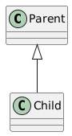
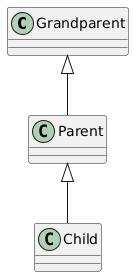
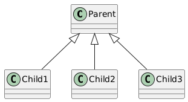
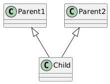

# 🧬 Inheritance in Java

**Inheritance** is an Object-Oriented Programming (OOP) concept where a **new class is derived**
from an **existing class**, inheriting its **attributes (variables)** and **methods**.

It helps achieve **code reusability**, **extensibility**, and **polymorphism**.

---

## 📌 Terminology

### Existing Class:
- Base Class
- Super Class
- Parent Class

### New Class:
- Sub Class
- Derived Class
- Child Class

```text
Child Class IS-A Parent Class
```

---

## 🧠 Why Use Inheritance?

- Avoids code duplication
- Improves maintainability
- Models real-world relationships
- Enables method overriding
- Foundation of polymorphism

---

## 🔑 Syntax of Inheritance

```java
class ChildClass extends ParentClass {
    // child-specific code
}
```

Keyword used:
```text
extends
```

---

# 🧩 Types of Inheritance in Java

Java supports **four conceptual types** of inheritance.

---

## 🅰️ 1. Single Inheritance

### 📌 Definition
One **child class** inherits from **one parent class**.

```text
Parent → Child
```

### 🧠 Use Case
- Simple and clean hierarchy
- Most commonly used inheritance type

---

### 📐 Diagram (Single Inheritance)



---

## 🅱️ 2. Multilevel Inheritance

### 📌 Definition
A **chain of inheritance** where:
- A class inherits another class
- And that class is inherited by another

```text
Grandparent → Parent → Child
```

---

### 🧠 Use Case
- Represents real-life hierarchy
- Enables layered behavior

---

### 📐Diagram (Multilevel Inheritance)



---

## 🅲 3. Hierarchical Inheritance

### 📌 Definition
Multiple **child classes** inherit from a **single parent class**.

```text
Parent → Child1
       → Child2
       → Child3
```

---

### 🧠 Use Case
- Common behavior shared
- Different implementations in subclasses

---

### 📐 PlantUML Diagram (Hierarchical Inheritance)



---

## 🅳 4. Multiple Inheritance (Conceptual)

### 📌 Definition
A class inherits from **multiple parent classes**.

```text
Parent1 + Parent2 → Child
```

---

### ⚠️ Important Note (VERY IMPORTANT)

❌ **Java does NOT support multiple inheritance using classes**  
✔️ Java supports multiple inheritance **using interfaces**

Reason:
- Avoids ambiguity (Diamond Problem)

---

### 📐 PlantUML Diagram (Multiple Inheritance – Conceptual)



---

## 🧠 Why Java Disallows Multiple Inheritance with Classes?

- Method ambiguity
- Diamond problem
- Complex method resolution

👉 Java solves this using **interfaces**, covered in advanced OOP.

---

## 🔐 Access Control in Inheritance

| Modifier | Accessible in Child |
|--------|--------------------|
| private | ❌ No |
| default | ✔️ Same package |
| protected | ✔️ Yes |
| public | ✔️ Yes |

---

## 🧠 Inheritance vs Composition (Pro Insight)

| Inheritance | Composition |
|-----------|------------|
| IS-A | HAS-A |
| Tight coupling | Loose coupling |
| Compile-time relationship | Runtime relationship |

👉 **Favor Composition over Inheritance** (Industry rule)

---

## 🎯 Interview One-Liners

- “Inheritance allows one class to acquire properties of another.”
- “It represents an IS-A relationship.”
- “Java does not support multiple inheritance using classes.”

---

## 🏁 Final Takeaways

- Inheritance promotes code reuse
- Uses `extends` keyword
- Java supports single, multilevel, hierarchical inheritance
- Multiple inheritance is achieved via interfaces
- Essential for polymorphism and method overriding